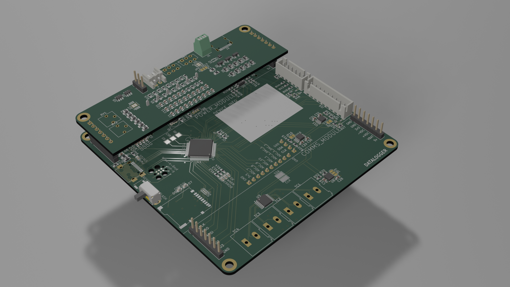

# ENEL400 datalogger

render of the datalogger with power board (yes i know it need routed)

this project has 2 main dirs
## hardware
this is where all the schmatics and PCBs live
within here you have the 
- `WB_based_board/datalogger` depecated one of lui projects that uses an stm32 with wireless built in
- `g4_based_board` has the schmatics and PCB for the datalogger
- `libs` for custom parts that wernt in kicad
- `lorawan_board/LoRaWAN_Board` never used dont look at this
- `power_board` as a power board that support 1 cell lipo and an external dc voltage
- `power_supply_module` i have forgotten more then likely the same as power_board

## software
this is where all the software for the project lives
- `conor code` this is where some depecated stm32cube projects live
- `ESP32_comms` this is where a basic code for the ESP32 lives
  - this code allow for any data spat out form the data logger to be sent off through an https request to some server, (i would suggest using the server in `emulator`)
- `Heltec ESP32 code` this is where the code live for a basic lorawan setup live 
- `joshM code/OLD_BOARD_SOFTWARE_UART_COMMS` this is josh Ms "Fork" of the `OLD_BOARD_SOFTWARE_UART_COMMS` code
- `New_G4_Software` this has basic code for the most recent PCB use the `NEW_G4_software.ioc` for creating any new projects you may need
- `OLD_BOARD_SOFTWARE_UART_COMMS` this is code that send a count a button count, a state that can be changed with buttons and an ADC value that gets sent over comms interface using UART, to be used in tandom with the `ESP32_comms` code
- `WB_software` depecated uses an stm32 that has wireless support
- `data_formats` holds the schema for the database on asure
- `dataloggerAPI` asure cloud server that handles all the HTTP requests and database lookups
- `emulator` emulates the datalogger so you can test server code with out a physical data logger 
- `g4_software` depecated fpr use on the original board

for any ESP32 code it is suggested to connect to a moblie hot spot as the uc wireless doesnt like them.
the software is a mess because some people dont know how to branch code