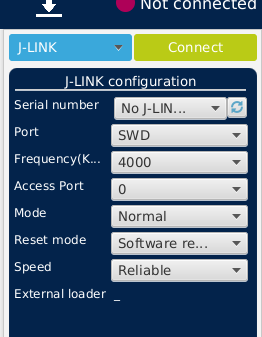
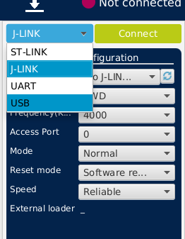
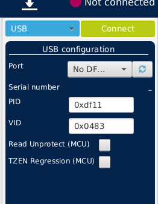
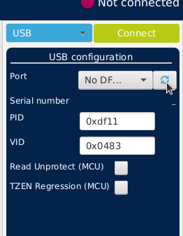
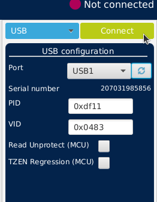
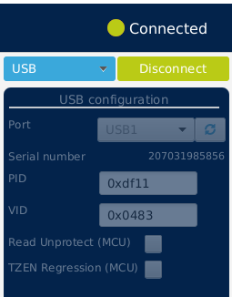
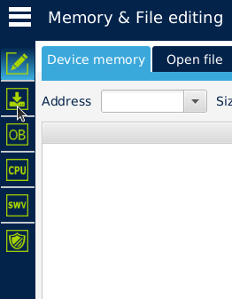
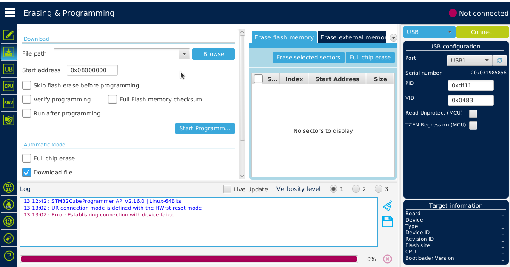
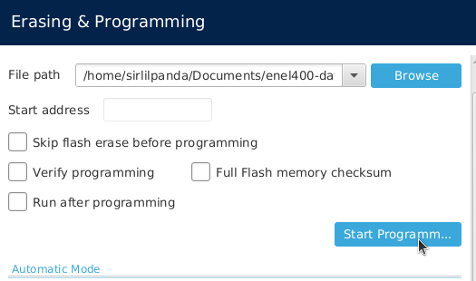

# how to program

## programming over USB

### what youll need
- USB C
- computer with stm32CubeIDE or stm32cubeprogrammer

1. plug stm32 data logger board in to the computer with a USB c cable
2. switch the boot mode switch to `prog`
3. press the reset button, you should hear a usb connect sound
4. open up STM32CubeProgrammer
5. within STM32CubeProgrammer select this drop down menu, and select usb

6. hit the refresh button on the port line, and something like USB1 will apper

7. after that click the connect, and you will be connected to the stm32 usb bootloader

8. now click the download button on the other side of the window, this will bring you to erasing and programming

9. next you will want to browse for the create `.elf` file that stm32cubeIDE spat out
10. then you hit program and then your new code will be uploaded

11. switch boot mode back to flash
12. hit reset
13. profit?

## programming over swd

### what youll need
- 6 pin plug-o-nails
- stlink
- computer with stm32CubeIDE or stm32cubeprogrammer

1. plug in the stlink to the computer with the 6 pin plug-o-nails connects
2. plug in a usb c cable (this is only for power as swd techanlly shouldnt be sending power to the board)
3. boot up either STM32cubeIDE or programmer, if you boot up programmer you can follow the same steps as USB but with swd instead
4. if you used STM32CubeIDE, you should just be able to click the build and upload button and it will be done (i have only done this method once, i suggest looking at the stm32g4 documentaion for exact details)